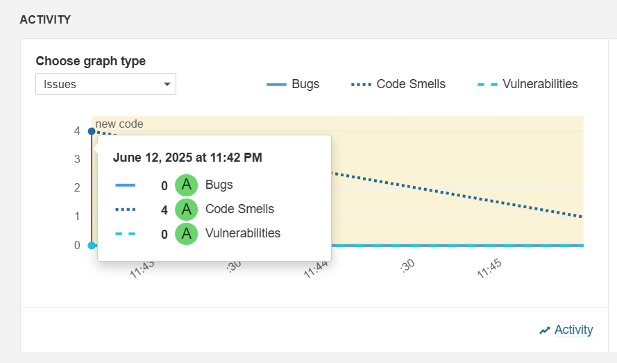
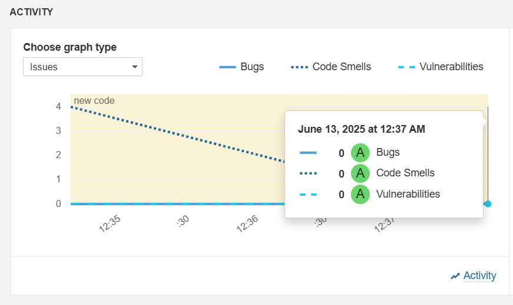

# ValidadorApp

Proyecto Java sencillo utilizado para realizar análisis estático de código con **SonarQube** y **Maven**. Este ejercicio tiene como objetivo identificar malas prácticas, errores potenciales y mejorar la calidad del código antes del despliegue.

## 📌 Objetivos del ejercicio

- Comprender qué es el análisis estático y su impacto en la calidad del software.
- Instalar y configurar SonarQube de forma local.
- Ejecutar análisis sobre un proyecto Java con Maven.
- Interpretar los reportes de SonarQube y aplicar mejoras.
- Preparar el proyecto para su integración con CI/CD.

## 🛠️ Instalación de SonarQube en Docker
```
docker run -d --name sonarqube -p 9000:9000 sonarqube:lts
```
## Acceder a SonarQube en http://localhost:9000
- **Usuario:** admin
- **Contraseña:** admin

**Cambia la contraseña al iniciar sesión*

## 🧪 Estructura del proyecto
Generado con Maven usando el siguiente comando:

```
mvn archetype:generate -DgroupId=com.equipo.validador \
-DartifactId=validadorapp \
-DarchetypeArtifactId=maven-archetype-quickstart \
-DinteractiveMode=false
```

## 📄 Código original (con malas prácticas)
```
public class App {
    public static void main(String[] args) {
        String usuario = "admin";
        String contraseña = "123456"; // Hardcoded credentials
        if (usuario.equals("admin")) {
            System.out.println("¡Bienvenido administrador!");
        }
    }
}
```

## ✅ Código mejorado
```
package com.equipo.validador;

import java.util.logging.Logger;

public class App {
    private static final Logger logger = Logger.getLogger(App.class.getName());

    public static void main(String[] args) {
        String usuario = System.getenv("APP_USER");
        if ("admin".equals(usuario)) {
            logger.info("¡Bienvenido administrador!");
        }
    }
}
```
## ✅Mejoras realizadas:
* Se eliminaron credenciales escritas en el código (hardcoded).
* Se utilizó una variable de entorno para el usuario.
* Se implementó un logger para evitar el uso de System.out.println.

## 📊 Análisis con SonarQube
Configuración en pom.xml:
```
<build>
  <plugins>
    <plugin>
      <groupId>org.sonarsource.scanner.maven</groupId>
      <artifactId>sonar-maven-plugin</artifactId>
      <version>3.9.1.2184</version>
    </plugin>
  </plugins>
</build>
```
Comando para ejecutar análisis:
```
mvn clean verify sonar:sonar \
  -Dsonar.projectKey=validadorapp \
  -Dsonar.host.url=http://localhost:9000 \
  -Dsonar.login=your_token_here
```

*Puedes generar un token desde:
My Account → Security en la interfaz de SonarQube.*

## 🧾 Resultados del análisis
### Antes de la mejora:
* Vulnerabilidad por uso de credenciales hardcodeadas.
* Malas prácticas: uso de System.out.println.
* Código sin logging estructurado.

### Después de la mejora:
* Sin vulnerabilidades detectadas.
* Mejora del Quality Gate.
* Código más seguro y mantenible.

## 📷 Capturas
### Antes de aplicar mejoras


### Después de aplicar mejoras


## 💬 Reflexión final
* **Errores detectados por SonarQube:** hardcoded credentials, uso inapropiado de salida por consola, ausencia de logs.

* **Ventajas del análisis estático:** permite detectar errores sin ejecutar el programa, promoviendo buenas prácticas desde etapas tempranas.

* **Impacto de SonarQube:** mejora la seguridad, legibilidad y mantenibilidad del software antes del despliegue.

* **Personalización de reglas:** se podrían ajustar según el dominio del proyecto, por ejemplo, reglas más estrictas en aplicaciones bancarias o médicas.
